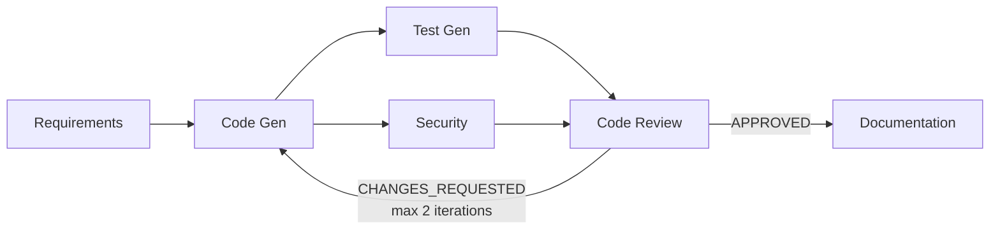

# Archon SDLC

A multi-agent AI system that turns user stories into production-ready code through an iterative, self-correcting pipeline on AWS.

## What This Actually Does

Archon SDLC takes a set of user stories and runs them through a pipeline of six specialized AI agents. Each agent handles one phase of the software development lifecycle: requirements analysis, code generation, test generation, security scanning, code review, and documentation. The agents run as AWS Lambda functions orchestrated by Step Functions, with each agent writing its artifacts to S3 and its metadata to DynamoDB.

The interesting part is the feedback loop. After the Code Review agent scores the generated code across seven quality dimensions, it issues a verdict — APPROVED, APPROVED_WITH_COMMENTS, or CHANGES_REQUESTED. If it requests changes, the pipeline loops back to Code Generation with the review feedback, then re-runs tests and security scanning on the revised code. This continues for up to two revision cycles, which means the system self-corrects rather than delivering a first draft.

The Security agent isn't just asking an LLM to guess at vulnerabilities. It runs [bandit](https://github.com/PyCQA/bandit) static analysis on the generated Python code first, then feeds the real findings to an AI model for interpretation and remediation guidance. This tool-augmented approach produces grounded security reports backed by actual analysis.

## One-Touch Deploy

**Prerequisites:**
- AWS CLI configured with credentials
- Node.js 18+
- Python 3.12+
- [uv](https://docs.astral.sh/uv/) package manager
- Bedrock model access enabled for: `amazon.nova-premier-v1:0`, `amazon.nova-pro-v1:0`, `amazon.nova-lite-v1:0`, `mistral.devstral-2-123b`

```bash
git clone <repo-url>
cd archon-sdlc
bash deploy.sh
```

`deploy.sh` packages all Lambda functions, builds the React frontend, bootstraps and deploys the CDK stack, then rebuilds the frontend with the real API URL and Cognito config. Total deploy time is ~5–8 minutes. It outputs the app URL, API URL, and the command to create your first user.

**Creating an account:**

After deploy completes, create a user via the AWS CLI (the User Pool ID is printed in the deploy output):

```bash
# Create the user
aws cognito-idp admin-create-user \
  --user-pool-id <USER_POOL_ID> \
  --username you@example.com \
  --temporary-password TempPass123 \
  --message-action SUPPRESS

# Set a permanent password (skips the force-change-password flow)
aws cognito-idp admin-set-user-password \
  --user-pool-id <USER_POOL_ID> \
  --username you@example.com \
  --password YourPermanentPassword \
  --permanent
```

Then log in at the app URL with the email and permanent password you set. Cognito handles auth — no sign-up page is exposed since this is a single-tenant portfolio project.

## Architecture



The pipeline runs as a Step Functions Standard Workflow. Test Gen and Security run in parallel after Code Gen completes. Code Review reads all prior artifacts before issuing its verdict. If the verdict triggers re-generation, the iteration counter increments and Code Gen receives the review feedback alongside the original spec.

## Pipeline in Action

The frontend provides a real-time view of the pipeline as it executes:

1. **Create a project** — enter a name, description, tech stack, and user stories. You can type stories manually, import a JSON file, or use the AI planner to generate stories from a project description.
2. **Watch the pipeline** — the dashboard shows each stage with live status updates, timestamps, and a per-stage cost breakdown (token usage × model pricing).
3. **Browse artifacts** — once stages complete, switch to the Artifacts tab to read the technical spec, browse generated source files with syntax highlighting, review test coverage, examine security findings, read the code review scorecard, and download documentation.

What each stage produces:

- **Requirements** — structured technical specification with data models, API contracts, and acceptance criteria
- **Code Gen** — complete application source code (multi-file, manifest-based)
- **Test Gen** — pytest test suite covering acceptance criteria and edge cases
- **Security** — bandit findings + AI-interpreted risk assessment with remediation guidance
- **Code Review** — 7-dimension quality scorecard, top issues (P1/P2/P3), verdict
- **Documentation** — README, API docs, architecture guide, deployment instructions

## Agent Architecture

| Agent | Model | What It Does | Key Detail |
|---|---|---|---|
| Requirements | Nova Premier | Transforms user stories into a technical spec | Structured markdown with data models, API contracts, acceptance criteria |
| Code Generation | Devstral 2 (123B) | Generates implementation code from the spec | Dual-mode: initial generation + revision from review feedback. `ast.parse()` validation on Python output |
| Test Generation | Devstral 2 (123B) | Produces test suites for the generated code | Covers acceptance criteria, edge cases, error handling |
| Security Scan | Nova Pro | Static analysis + AI interpretation | Runs bandit first, then uses AI to contextualize findings and add remediation guidance |
| Code Review | Nova Premier | Multi-dimensional code review with verdict | Scores 7 dimensions (spec compliance, code quality, architecture, error handling, test coverage, security posture, production readiness). Drives the feedback loop |
| Documentation | Nova Lite | Generates README and API docs from all artifacts | Runs only after the feedback loop converges |

**Why different models?** Each agent's task has different characteristics. Code generation and test generation benefit from a code-specialized model (Devstral), while requirements analysis and code review need strong reasoning (Nova Premier). Documentation is a straightforward synthesis task, so it uses the cheapest model (Nova Lite). This task-appropriate selection also optimizes cost — a full pipeline run costs roughly $0.05–0.10.

**Why tool-augmented security?** Pure LLM security analysis risks hallucinated vulnerabilities. Running bandit first produces real static analysis findings, which the AI model then interprets with context and remediation guidance. The report clearly separates tool findings from AI analysis.

**Why the feedback loop matters.** Without it, you get a linear pipeline that delivers a first draft. With it, Code Review acts as a quality gate that can reject code and demand specific improvements, transforming the system from a generator into a self-correcting one.

## Tech Stack

**Infrastructure:** AWS CDK v2 (TypeScript), Lambda (Python 3.12, ARM64), Step Functions (Standard Workflow), API Gateway HTTP API, DynamoDB (single-table design), S3 (artifacts + frontend hosting), CloudFront (CDN), Cognito (auth), Amazon Bedrock (multi-model).

**Frontend:** React 18, TypeScript, Vite, Tailwind CSS, shadcn/ui.

The entire system is fully serverless — zero containers, no Docker dependency, no ECS/EKS. Every component runs on managed AWS services.

## Key Design Decisions

**Fully serverless instead of containers.** The entire system deploys with a single `bash deploy.sh` command. No Docker builds, no container registries, no ECS task definitions. Lambda cold starts are acceptable here because pipeline stages run for 10–60+ seconds each — the ~1 second cold start is noise. The cost model is also favorable: you pay per invocation, not for idle compute.

**Step Functions instead of LangGraph or a custom orchestrator.** Step Functions gives you a visual execution history in the AWS Console for free, native support for parallel branches and choice states (which power the feedback loop), and declarative retry/error handling. The state machine definition is ~200 lines of CDK code. A custom orchestrator would need its own error handling, state persistence, and observability — all of which Step Functions provides out of the box.

**Multi-model instead of one model for everything.** Using a single model for all agents would be simpler but wasteful. Devstral 2 is a 123B-parameter code-specialized model — it's excellent at generating code but costs more than Nova Lite, which handles documentation just as well. Nova Premier's reasoning capability is worth the cost for requirements analysis and code review, where judgment quality directly affects pipeline output. This per-agent model selection reduces cost by ~60% compared to using the most capable model everywhere.

**Tool-augmented security instead of ReAct.** ReAct-style tool use adds value when agents need to discover information through iterative exploration. The Security agent doesn't need that — it receives complete code context and needs to produce structured findings. Running bandit first gives it concrete static analysis results to interpret, which is more reliable than asking an LLM to simultaneously find and categorize vulnerabilities.

**The feedback loop is the core differentiator.** Most AI code generation tools run once and deliver output. The feedback loop transforms this into a system that evaluates its own work and iterates. Code Review scores across seven dimensions and can cite specific issues. Code Gen receives this feedback and revises targeted sections. The result is measurably better code on iteration 2 than iteration 1.

## Project Structure

```
archon-sdlc/
├── backend/
│   ├── agents/                    # 6 pipeline agents + 1 planner
│   │   ├── requirements_agent/
│   │   ├── codegen_agent/
│   │   ├── testgen_agent/
│   │   ├── security_agent/
│   │   ├── codereview_agent/
│   │   ├── documentation_agent/
│   │   └── planner_agent/
│   ├── api/                       # 7 API handler Lambdas
│   └── shared/                    # Shared library (Bedrock, DynamoDB, S3, models)
├── frontend/                      # React + TypeScript + Vite
│   └── src/
│       ├── components/            # Dashboard, ArtifactViewer, ProjectCreator, etc.
│       ├── api/                   # API client
│       ├── auth/                  # Cognito auth context
│       ├── hooks/                 # Polling hook
│       └── lib/                   # Cost calculation
├── infrastructure/                # CDK v2 (TypeScript)
│   └── lib/constructs/
│       ├── pipeline.ts            # Step Functions + agent Lambdas
│       ├── api.ts                 # API Gateway + handler Lambdas
│       ├── auth.ts                # Cognito User Pool
│       ├── storage.ts             # DynamoDB + S3
│       └── frontend.ts            # S3 + CloudFront
├── deploy.sh                      # One-touch deployment
└── cleanup.sh                     # Full teardown of AWS resources
```

## How It Maps to Enterprise AI Delivery

The architecture behind Archon SDLC reflects patterns used in enterprise agentic AI platforms for large-scale software delivery. Each agent is a composable, independently deployable unit with a single responsibility — the same pattern that enables agent marketplaces where teams plug in specialized agents for their domain. The multi-model orchestration demonstrates that production AI systems rarely use a single model; they route tasks to the most cost-effective model capable of handling them.

The feedback loop implements the iterative quality gate pattern found in enterprise CI/CD pipelines, but at the AI generation layer. Tool-augmented analysis (bandit + AI interpretation) shows how to ground LLM output in real tooling — a critical pattern for enterprise trust. The Step Functions orchestration provides the execution visibility and audit trail that enterprise deployments require.

## Future Enhancements

- **Test Execution Agent** — run generated tests in a sandboxed Lambda environment using `/tmp` for pip install + pytest execution, producing real pass/fail results
- **Dependency resolution validation** — verify that generated import statements resolve against actual packages before declaring code complete
- **DSPy-based prompt optimization** — use pipeline output quality signals (code review scores, security findings) as a feedback signal to automatically tune agent prompts
- **CloudWatch custom metrics + X-Ray tracing** — per-agent latency, token usage, and cost metrics with distributed tracing across the full pipeline
- **Cost allocation tagging and budget alerts** — tag AWS resources per-project for cost attribution, alert when pipeline costs exceed thresholds
- **Webhook notifications** — Slack or email notifications on pipeline completion, failure, or when code review requests changes
- **Multi-language support** — extend Code Gen and Test Gen beyond Python to TypeScript, Java, and Go with language-specific validation and tooling

## Cleanup

```bash
bash cleanup.sh
```

Tears down all AWS resources (CloudFront, S3, API Gateway, Lambda, Step Functions, DynamoDB, Cognito) with safety confirmations. Optionally removes CDK bootstrap resources and local build artifacts.

## License

MIT
