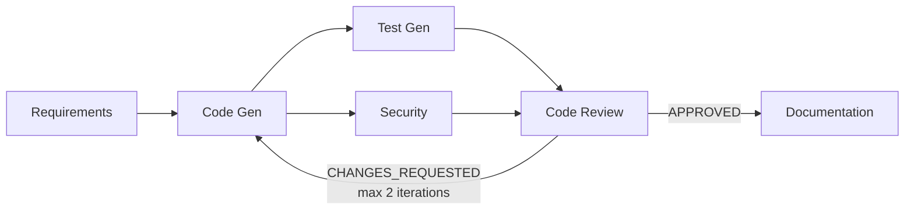
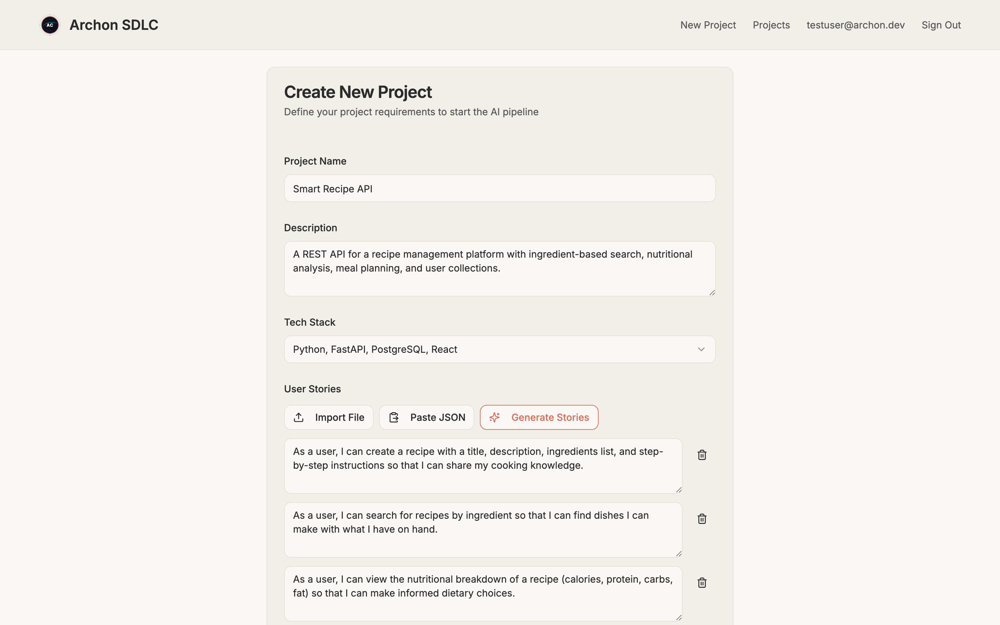
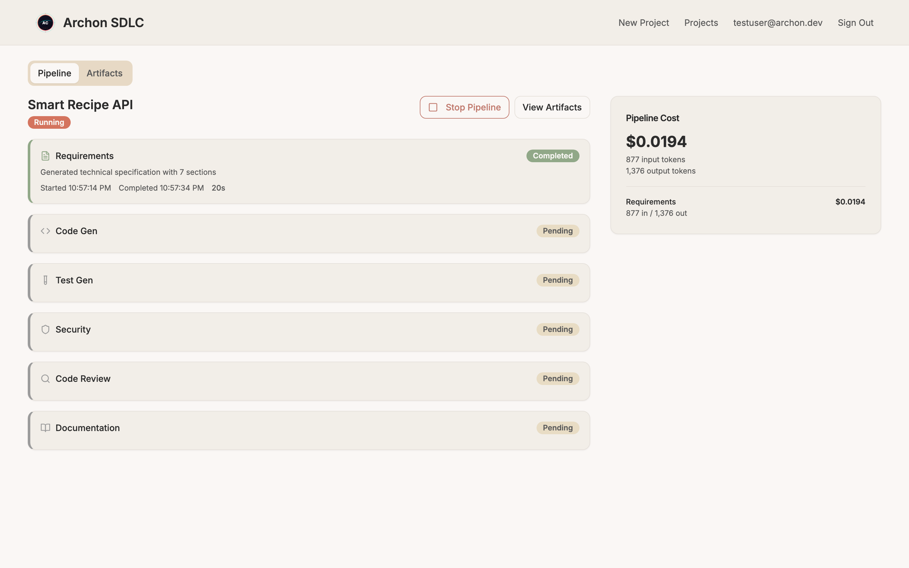
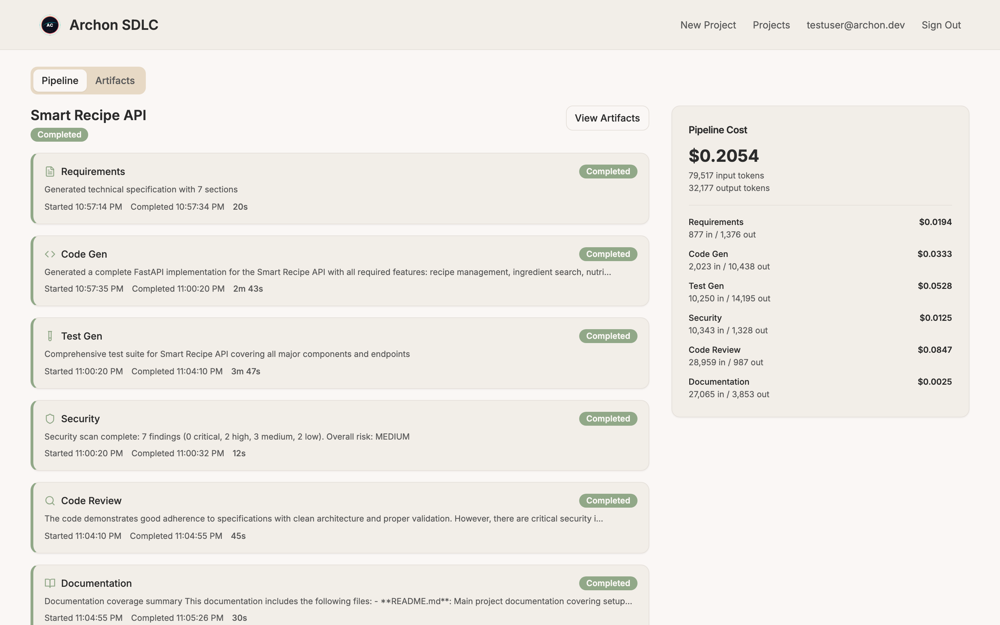
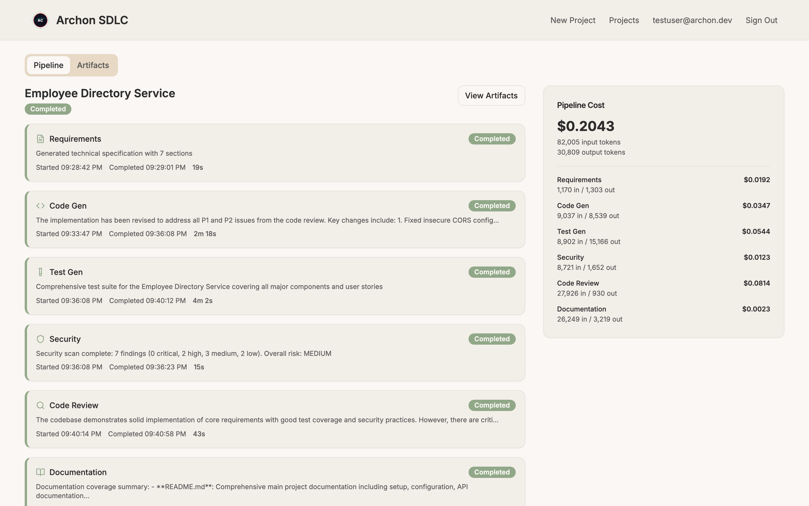
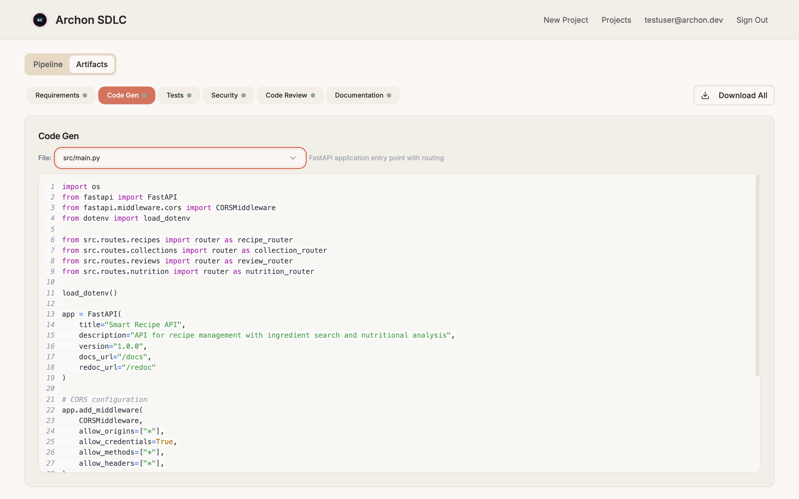
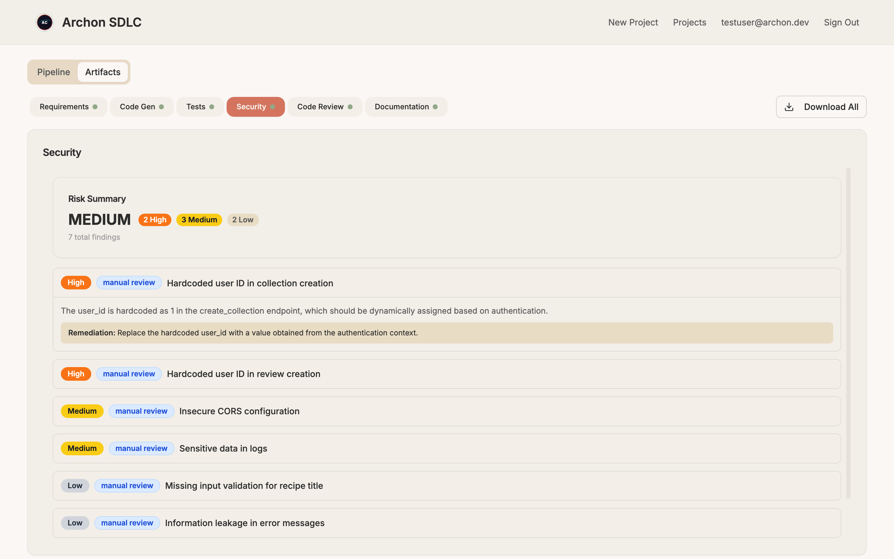
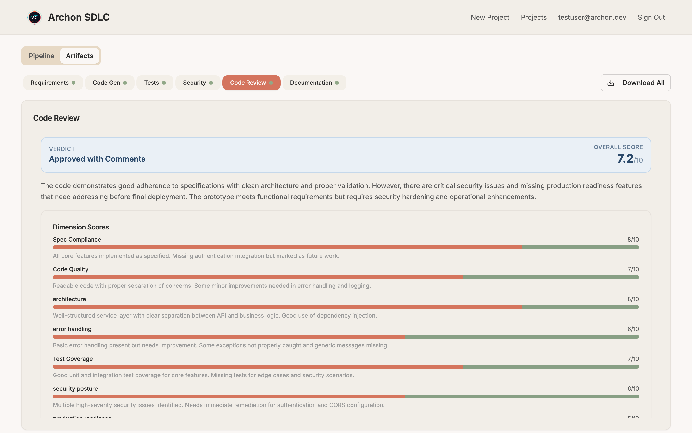

# Archon SDLC

A multi-agent AI system that turns user stories into production-ready code through an iterative, self-correcting pipeline on AWS.

## What This Actually Does

Archon SDLC takes a set of user stories and runs them through a pipeline of six specialized AI agents. Each agent handles one phase of the software development lifecycle: **Requirements Analysis** transforms user stories into a structured technical specification. **Code Generation** produces a complete, multi-file application from that spec. **Test Generation** writes a pytest suite covering acceptance criteria and edge cases. **Security Scanning** runs bandit static analysis on the generated code, then uses AI to interpret findings and produce remediation guidance. **Code Review** evaluates the output across seven quality dimensions and issues a verdict. **Documentation** generates a README, API reference, and architecture guide from the full artifact set.

The interesting part is the feedback loop. After Code Review scores the generated code, it returns one of three verdicts — APPROVED, APPROVED\_WITH\_COMMENTS, or CHANGES\_REQUESTED. If it requests changes, the pipeline loops back to Code Generation with the review feedback injected into the prompt, then re-runs tests and security scanning on the revised code. This continues for up to two revision cycles, which means the system self-corrects rather than delivering a first draft.

The Security agent isn't just asking an LLM to guess at vulnerabilities. It runs [bandit](https://github.com/PyCQA/bandit) static analysis on the generated Python code first, producing real findings with line numbers and severity ratings. The AI model then interprets those findings in context and adds remediation guidance. This tool-augmented approach produces grounded security reports backed by actual analysis, not hallucinated vulnerability lists.

## One-Touch Deploy

### Deploy

The entire system deploys to your AWS account with one script.

**Prerequisites:**
- AWS CLI configured with credentials
- Node.js 18+
- Python 3.12+
- [uv](https://docs.astral.sh/uv/) package manager
- Bedrock model access enabled for the following models (AWS Console → Bedrock → Model access → Manage model access):
  - `amazon.nova-premier-v1:0` — requirements analysis, code review
  - `amazon.nova-pro-v1:0` — security analysis
  - `amazon.nova-lite-v1:0` — documentation
  - `mistral.devstral-2-123b` — code generation, test generation (listed under Mistral AI in the Bedrock console)

```bash
git clone https://github.com/ashwinchidambaram/archon-sdlc.git
cd archon-sdlc
./deploy.sh
```

`deploy.sh` runs through these steps in order:
1. Validates prerequisites — checks for AWS CLI, Node.js, Python, uv, and verifies AWS credentials
2. Checks Bedrock model access — confirms all four models are accessible, warns if any are missing
3. Packages Lambda functions — installs the shared library into each agent's `package/` directory using uv, copies handlers
4. Builds the React frontend — runs `npm ci` and `npm run build`, using the existing API URL if the stack was previously deployed or a placeholder for first-time deploys
5. Deploys the CDK stack — runs `cdk bootstrap` (idempotent) and `cdk deploy`, creating all AWS resources
6. Rebuilds the frontend with real URLs — extracts the API URL and Cognito config from CloudFormation outputs, rebuilds, and redeploys to sync assets

Deploy time is ~5–8 minutes. A full pipeline run costs roughly $0.05–0.10 in Bedrock inference charges.

When deploy completes, you'll see the app URL and API URL printed to your terminal. The output also includes the Cognito User Pool ID and a command to create your first user:

```bash
# Create the user
aws cognito-idp admin-create-user \
  --user-pool-id <USER_POOL_ID> \
  --username you@example.com \
  --temporary-password TempPass123 \
  --message-action SUPPRESS

# Set a permanent password (skips the force-change-password flow)
aws cognito-idp admin-set-user-password \
  --user-pool-id <USER_POOL_ID> \
  --username you@example.com \
  --password YourPermanentPassword \
  --permanent
```

Open the app URL and log in with the email and password you set.

### Destroy

All resources can be torn down with one command.

```bash
./cleanup.sh
```

`cleanup.sh` confirms the destructive action, then runs `cdk destroy --force`. This removes all Lambda functions, the Step Functions state machine, API Gateway, the DynamoDB table (including all project data), both S3 buckets (frontend assets and pipeline artifacts), the CloudFront distribution, the Cognito User Pool, and all associated IAM roles. Nothing is left behind — no orphaned resources, no lingering costs.

Bedrock model access is managed separately through the AWS Console. CDK didn't enable it, and destroying the stack won't disable it. If you want to revoke model access, do that manually in the Bedrock console.

Destroy time is ~2–3 minutes.

## Architecture



The pipeline runs as a Step Functions Standard Workflow. Test Gen and Security run in parallel after Code Gen completes. Code Review reads all prior artifacts before issuing its verdict. If the verdict triggers re-generation, the iteration counter increments and Code Gen receives the review feedback alongside the original spec.

## Pipeline in Action


*Create a project with a name, description, and user stories. Import from JSON, type manually, or use the AI planner to generate stories from a description.*


*The dashboard shows each stage with live status, timestamps, and a running cost breakdown. Here, Requirements has completed and the pipeline is moving to Code Gen.*


*All six stages completed. The cost panel shows per-stage token usage and total pipeline cost ($0.21 for this run). Code Gen's summary mentions revising code to address P1 and P2 issues — the feedback loop in action.*


*The Employee Directory project shows a completed feedback loop: Code Review requested changes on iteration 0, Code Gen revised the code on iteration 1, and the final review approved with comments. The summary reads "revised to address all P1 and P2 issues from the code review."*


*The artifact viewer shows generated source code with syntax highlighting. This is `src/main.py` — a complete FastAPI application with routing, CORS, and module imports. The file selector lists all 17 generated files.*


*The Security agent found 7 issues (2 High, 3 Medium, 2 Low) with an overall risk rating of MEDIUM. Each finding includes a severity badge, source, description, and specific remediation guidance.*


*Code Review scored the output 7.2/10 across seven dimensions (Spec Compliance, Code Quality, Architecture, Error Handling, Test Coverage, Security Posture, Production Readiness) and returned APPROVED WITH COMMENTS.*

## Agent Architecture

| Agent | Model | What It Does | Key Detail |
|---|---|---|---|
| Requirements | Nova Premier | Transforms user stories into a technical spec | Structured markdown with data models, API contracts, acceptance criteria |
| Code Generation | Devstral 2 (123B) | Generates implementation code from the spec | Dual-mode: initial generation + revision from review feedback. `ast.parse()` validation on Python output |
| Test Generation | Devstral 2 (123B) | Produces test suites for the generated code | Covers acceptance criteria, edge cases, error handling |
| Security Scan | Nova Pro | Static analysis + AI interpretation | Runs bandit first, then uses AI to contextualize findings and add remediation guidance |
| Code Review | Nova Premier | Multi-dimensional code review with verdict | Scores 7 dimensions. Drives the feedback loop — CHANGES\_REQUESTED triggers re-generation |
| Documentation | Nova Lite | Generates README and API docs from all artifacts | Runs only after the feedback loop converges |

**Why different models?** Each agent's task has different characteristics. Code generation and test generation benefit from a code-specialized model (Devstral 2, 123B parameters), while requirements analysis and code review need strong reasoning (Nova Premier). Documentation is straightforward synthesis, so it uses the cheapest model (Nova Lite). This task-appropriate model selection reduces cost by ~60% compared to using the most capable model everywhere.

## Tech Stack

**Infrastructure:** AWS CDK v2 (TypeScript), Lambda (Python 3.12, ARM64), Step Functions (Standard Workflow), API Gateway HTTP API, DynamoDB (single-table design), S3 (artifacts + frontend hosting), CloudFront (CDN), Cognito (auth), Amazon Bedrock (multi-model).

**Frontend:** React 18, TypeScript, Vite, Tailwind CSS, shadcn/ui.

The entire system is fully serverless — zero containers, no Docker dependency, no ECS/EKS. Every component runs on managed AWS services.

## Design Decisions

**Fully serverless, no containers.** One-touch deploy was a hard requirement. Lambda + CDK means no Docker dependency for the deployer, no ECR image builds, no container orchestration. The three commands to deploy are `git clone`, `cd`, and `./deploy.sh` — no Dockerfile anywhere. Lambda's 15-minute timeout and Step Functions' 256KB payload limit are the tradeoffs, both mitigated by passing artifacts through S3 rather than inline in state machine payloads.

**Step Functions over LangGraph or a custom orchestrator.** Step Functions gives you a visual execution history in the AWS Console for free — you can inspect every state transition, see input/output for each Lambda invocation, and replay failed executions. It natively supports parallel branches (Test Gen + Security run concurrently), choice states (the feedback loop verdict), and declarative retry/error handling. The feedback loop is expressed as a state machine, not imperative code. The tradeoff is tighter coupling to AWS and the 256KB payload limit between states.

**Multi-model agent assignment.** Each agent uses the model best suited to its task. Devstral 2 is a 123B-parameter code-specialized model — it generates syntactically valid, well-structured code but costs more than Nova Lite, which handles documentation just as well. Nova Premier's reasoning capability is worth the cost for requirements analysis and code review, where judgment quality directly affects pipeline output. This mirrors how enterprise AI platforms operate — you don't use your most expensive model for every task.

**Tool-augmented security instead of ReAct everywhere.** ReAct adds value when an agent needs to discover information through iterative exploration. Most agents in this pipeline receive complete context and do synthesis — they don't need tools. The Security agent is the exception: static analysis tools like bandit catch things LLMs miss (AST-level patterns, known CVE matches). So it runs bandit first via subprocess, then uses AI to interpret and contextualize the findings. The report clearly separates tool findings from AI analysis. Applying ReAct to all agents would have tripled pipeline latency (3–5 Bedrock calls per agent instead of 1) with minimal quality improvement.

**Iterative feedback loop as the core differentiator.** Most multi-agent demos are linear chains. The Code Review → Code Generation feedback loop transforms this into a self-correcting system. Code Review evaluates the generated code against the spec, scores it across seven dimensions (spec compliance, code quality, architecture, error handling, test coverage, security posture, production readiness), and returns a verdict with specific issues. If it returns CHANGES\_REQUESTED, the pipeline loops back with the review feedback injected into the Code Gen prompt. This inter-agent iteration is more architecturally interesting than intra-agent tool use, and it's closer to how real software development works — code review driving revisions.

**Standard Workflow over Express Workflow.** The pipeline takes 3–5 minutes with the feedback loop. Express Workflows have a 5-minute hard ceiling. Standard Workflows support up to a year of execution time and provide persistent execution history inspectable in the AWS Console after the fact — useful for debugging and demos.

**Syntax validation (ast.parse) baked into Code Gen.** Every generated Python file is parsed with `ast.parse()` immediately after generation. Syntax failures are recorded in the file manifest and surfaced to Code Review, which flags them as P1 issues triggering the feedback loop. This means the system self-corrects syntax errors automatically without human intervention.

## Project Structure

```
archon-sdlc/
├── backend/
│   ├── agents/                    # 6 pipeline agents + 1 planner
│   │   ├── requirements_agent/
│   │   ├── codegen_agent/
│   │   ├── testgen_agent/
│   │   ├── security_agent/
│   │   ├── codereview_agent/
│   │   ├── documentation_agent/
│   │   └── planner_agent/
│   ├── api/                       # API handler Lambdas
│   └── shared/                    # Shared library (Bedrock, DynamoDB, S3, models)
├── frontend/                      # React + TypeScript + Vite
│   └── src/
│       ├── components/            # Dashboard, ArtifactViewer, ProjectCreator, etc.
│       ├── api/                   # API client
│       ├── auth/                  # Cognito auth context
│       ├── hooks/                 # Polling hook
│       └── lib/                   # Cost calculation
├── infrastructure/                # CDK v2 (TypeScript)
│   └── lib/constructs/
│       ├── pipeline.ts            # Step Functions + agent Lambdas
│       ├── api.ts                 # API Gateway + handler Lambdas
│       ├── auth.ts                # Cognito User Pool
│       ├── storage.ts             # DynamoDB + S3
│       └── frontend.ts            # S3 + CloudFront
├── deploy.sh                      # One-touch deployment
└── cleanup.sh                     # Full teardown
```

## How It Maps to Enterprise AI Delivery

The architecture behind Archon SDLC reflects patterns used in enterprise agentic AI platforms for large-scale software delivery. Each agent is a composable, independently deployable unit with a single responsibility — the same pattern that enables agent marketplaces where teams plug in specialized agents for their domain. The multi-model orchestration demonstrates that production AI systems rarely use a single model; they route tasks to the most cost-effective model capable of handling them.

The feedback loop implements the iterative quality gate pattern found in enterprise CI/CD pipelines, but applied at the AI generation layer. Tool-augmented analysis (bandit + AI interpretation) shows how to ground LLM output in real tooling — a critical pattern for enterprise trust. Step Functions orchestration provides the execution visibility and audit trail that enterprise deployments require: every state transition, every input/output, every retry is logged and inspectable.

## Expanding the System

**Test Execution Agent.** Add a 7th agent that writes generated code and tests to Lambda's `/tmp` directory, runs `pip install --target /tmp/packages` for dependencies, and executes pytest as a subprocess. Test results (pass/fail counts, failure messages) feed into Code Review as additional context — failures become P1 issues that trigger the feedback loop for automatic remediation. Requires bumping Lambda memory to 1024MB and enabling ephemeral storage.

**Containerized execution sandbox.** For integration testing beyond unit tests, the Test Execution Agent could build a Docker image of the generated project via AWS CodeBuild, run it in ECS Fargate, hit its API endpoints with generated test payloads, and tear down the container. This would prove not just that tests pass, but that the application starts, serves traffic, and behaves correctly under real conditions.

**Dependency resolution validation.** Parse all import statements from generated code using Python's `ast` module, cross-reference against the generated `requirements.txt` and Python's stdlib module list, and flag mismatches. This catches a common LLM failure mode where models import libraries they forget to declare as dependencies — the kind of error that only surfaces at install time.

**Prompt optimization with DSPy.** Instrument the pipeline to collect output quality signals — syntax validation pass rate, Code Review scores across iterations, security finding severity distributions — and use DSPy to systematically optimize agent prompts against those metrics. This replaces hand-crafted prompt engineering with data-driven optimization and provides measurable improvement tracking.

**Observability.** CloudWatch custom metrics for per-agent latency, token consumption, and cost. X-Ray distributed tracing across the Step Functions → Lambda → Bedrock call chain for end-to-end request visibility. Cost allocation tags on all resources for chargeback tracking. CloudWatch alarms on pipeline failure rate and cost anomalies.

**Multi-tenant auth and isolation.** Cognito user pools for authentication with API Gateway authorizer integration. Project-level access control in DynamoDB using tenant-partitioned keys. S3 bucket policies scoping artifact access per user. This transforms the system from a single-user demo into a shared platform.

**Multi-language support.** The current pipeline generates Python. Extending to TypeScript, Java, or Go requires updating the Code Gen and Test Gen prompts per language, swapping bandit for language-appropriate static analysis tools (ESLint for TypeScript, SpotBugs for Java, gosec for Go), and replacing `ast.parse()` with language-specific syntax validators.

**Webhook notifications.** SNS topic triggered on pipeline completion or failure, with Lambda-backed subscriptions to Slack, email, or arbitrary webhook endpoints. Useful for async workflows where the user kicks off a pipeline and walks away.

## License

MIT
